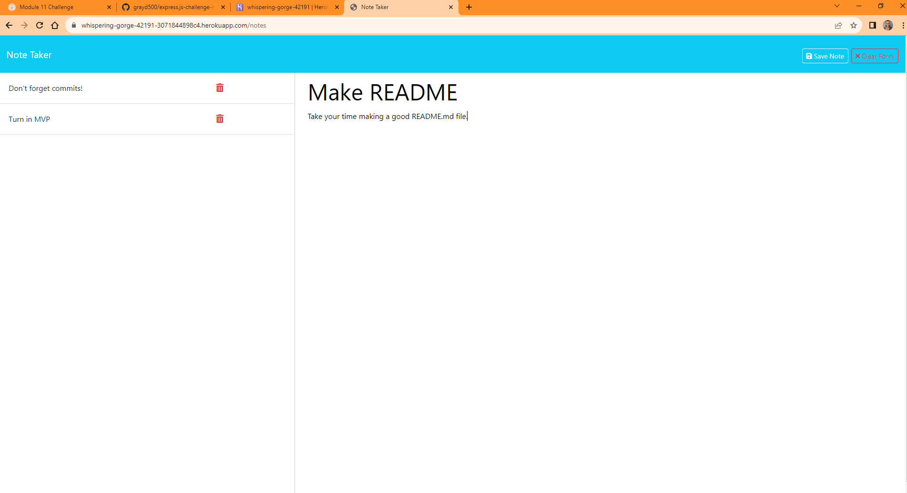

# Express.js Note Taker

## Description

The Express.js Note Taker is a sleek, dynamic application that enables users, especially busy professionals like small business owners, to jot down and manage their notes with ease.

- **Motivation**: In a digital age, quick note-taking is essential. Traditional paper-based methods are not efficient, and hence, the move to a digital platform is logical.
- **Purpose**: This project streamlines the note-taking process, allowing users to write, save, view, and delete notes. It's all about staying organized and on top of tasks.
- **Problem Solved**: Provides a centralized platform for managing notes, eliminating the clutter of scattered post-its and paper.
- **Learning**: Diving deep into the Express.js framework, understanding the intricacies of routing, and integrating the frontend with a backend API.

## Table of Contents

- [Installation](#installation)
- [Usage](#usage)
- [Credits](#credits)
- [License](#license)

## Installation

1. Clone the GitHub repository locally to your computer.
2. Navigate to the project directory in your terminal.
3. Install necessary dependencies by running `npm install`.
4. Once installed, start the server by running `npm start` or `node server.js`.

## Usage

To use the Express.js Note Taker:

1. Access the application through the [deployed Heroku link](https://whispering-gorge-42191-3071844898c4.herokuapp.com/notes).
2. Start by creating a new note with a title and description.
3. Save the note using the save icon.
4. Access existing notes by clicking on their titles.
5. Delete notes using the trashcan icon next to each note.

## Credits

This project was initiated with starter code provided by the UTA Coding Bootcamp. 
- Main development and backend functionality by [GrayD500](https://github.com/grayd500/).
- Special thanks to **CHATGPT4** for guidance on server.js commenting and README.md formatting.

## License

This project is licensed under the [MIT LICENSE](https://github.com/grayd500/express.js-challenge-note-taker-challenge/blob/main/LICENSE).

---
## Github Repo
[Note Taker Challenge](https://github.com/grayd500/express.js-challenge-note-taker-challenge)
